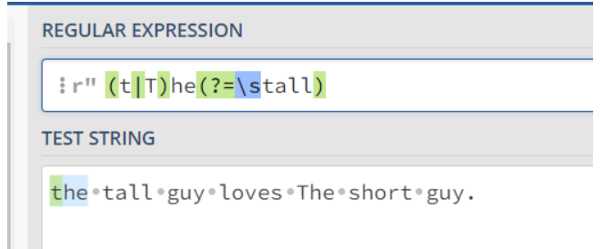

# REGEXP  /……/

- 注意：python中关于正则表达式的应用不用使用“/”进行界定，而是将字符串直接填入规定位置
- 有些地方并不要求完整的正则表达式，如crawlSpider中创建LinkExtractor对象时，参数allow的填写
- 他是专门用来匹配链接的。如www.abcd?page=1 这样的url，你想获取该页面中含有的页面url
- 你只需要写你观察到的所有url的共有特征
- 如：allow = r"page=\d*",这样他就能获取完整的url
- ps：该链接提取器还会帮你补齐url前缀

练习网址：https://regex101.com/

# 1. 直接匹配


# 2. 元字符

## (1)  .   匹配单个字符 

- 不包含换行符（但包含空格）


## (2) []  字符集

- 里面写可能出现的字符，不关心顺序，（只匹配一个字符）


- []里有# ， a-z, T-Z ,所以可以匹配到如上图

## (3) [^] 否定字符集 

- 在方括号内做开头时，表示否定。表示**“除了……之外”**


- 可见结果和上面的[]完全相反


## (4)  *   ，*前出现 0~n次


- 前面不加* 的案例中，字符集中只能匹配一个。1asa中只有sa符合，加了*之后那么a前面可以多个字符集中符合的字符
- 此时1asa中 asa 符合了，不再时sa，因为as都是a-z


## (5) + ， +前出现至少一次

- 看看和*的区别

- 

  

- 可以发现第二个字母e不再匹配了，其前面是“ 0”个r。


## (6) ？ ， ？前出现0或1次

- 当？ 跟在字符集后 表示 出现1或0次，后文可以见其在切换匹配模式上的用法


- 使用* ，rrre 能够匹配，前面有3个r
- 
- 使用？，rrre 不能匹配，因为只匹配 0~1 个r


## (7) {}, 指定出现次数

- {4} 刚好4个

- {4，}4个以上

- {3，4}最少3个最多4个

- {，3}最多3个

  

## (8)  () 特征标群

- 写在括号内的字符在意顺序

  

- 发现abc  是 而 bca不是

## (9) | 或


- 匹配the/The/car

## (10) \  反斜杠转义字符

- 不加 \ ,  "." 用于匹配任意字符

- " \\." 用于匹配 “.”

  

  

- 特别的，[]和（）中写啥就是啥，不需要转义字符

- [.]匹配的就是“.”

## (11) 锚点 字符串开头结尾

- ^ 表示开端

- $ 表示结尾

  

- abc不以b开头，无法匹配到


- 是作用于整个用于匹配的字符串的。可见acd并没有匹配到

  


# 3. 简写字符集

正则表达式提供一些常用的字符集简写。如下:

| 简写 |                        描述                        |
| ---- | :------------------------------------------------: |
| .    |                除换行符外的所有字符                |
| \w   |      匹配所有字母数字，等同于 `[a-zA-Z0-9_]`       |
| \W   |    匹配所有非字母数字，即符号，等同于： `[^\w]`    |
| \d   |                 匹配数字： `[0-9]`                 |
| \D   |                匹配非数字： `[^\d]`                |
| \s   |    匹配所有空格字符，等同于： `[\t\n\f\r\p{Z}]`    |
| \S   |            匹配所有非空格字符： `[^\s]`            |
| \f   |                   匹配一个换页符                   |
| \n   |                   匹配一个换行符                   |
| \r   |                   匹配一个回车符                   |
| \t   |                   匹配一个制表符                   |
| \v   |                 匹配一个垂直制表符                 |
| \p   | 匹配 CR/LF（等同于 `\r\n`），用来匹配 DOS 行终止符 |


# 4. 零宽度断言/前后预查

- **断言需要用（）**

| 符号 |      描述       |
| ---- | :-------------: |
| ?=   | 正先行断言-存在 |
| ?!   | 负先行断言-排除 |
| ?<=  | 正后发断言-存在 |
| ?<!  | 负后发断言-排除 |


## (1) 正先行断言（后面跟啥）

- (?=)

- 不加断言

  

- 我们想要匹配到the/The, 且后面是“ tall”

  

## （2）负先行断言 （后面不跟啥）

- (?!)


## （3）正后发断言（前面跟啥）

- （？<=）


- 前面跟 the/The + 空格  的short 或者 tall

## （4）负后发断言 （前面不跟啥）


- 前面不跟the+空格的short 或者tall


# 5.标志

| i    |                     忽略大小写。                      |
| :--- | :---------------------------------------------------: |
| g    |                      全局搜索。                       |
| m    | 多行修饰符：锚点元字符 `^` `$` 工作范围在每行的起始。 |


- 标志写在/ 表达式/ 后， 如    

- ```python
  r"/(T)+a/gm"
  # 全局上，每行 匹配所有符合的字符
  ```

- 


- 全称如下
- 
- 如果没有g，就是只匹配第一个


# 6. 贪婪匹配 和 惰性匹配  ，  ？的使用


- 当？ 跟在字符集后，如   /[a]?a/ 匹配a前有0到1个a的字符
- 当？ 跟在表示重复次数的符号后时，用于改变匹配模式。
- 加了？ 后由贪婪匹配改为惰性匹配


- 正则表达时默认贪婪匹配，即符合规则的尽可能长


- 可以发现at前可以有 任意个任意字符
- 那么一整串除了最后的句号以外，可以视为一个长的符合规则的字符串


- 加了？ 之后由贪婪匹配改为惰性匹配，将让匹配的结果尽可能短


- 可以看见 the fat 和cat ………… 分别匹配上了，而不是就只有一整串
- 
